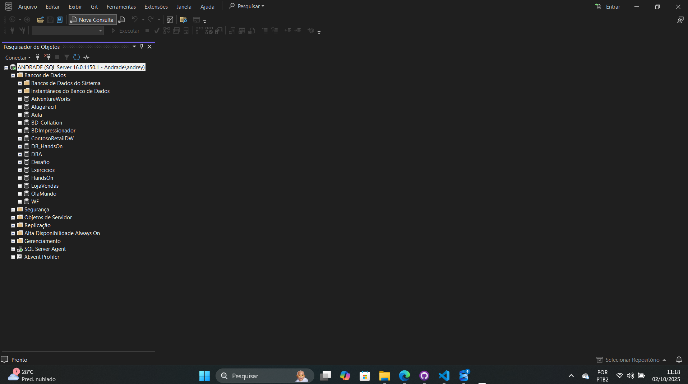

# Projeto 1 - Criação e Configuração de Banco de Dados no SQL Server

Este repositório faz parte do meu portfólio como **DBA Júnior**, demonstrando conhecimentos em instalação, configuração e administração básica de bancos de dados no **SQL Server**.

---

## 🎯 Objetivo

Este projeto tem como objetivo demonstrar habilidades fundamentais de um **DBA Júnior**, incluindo:

- Criação e configuração de um banco de dados no SQL Server
- Criação de tabelas relacionadas (Clientes, Produtos, Vendas, ItensVenda)
- Inserção de dados de exemplo para testes
- Organização de scripts SQL em repositório
- Documentação do ambiente de desenvolvimento

---

## 🖥️ Ambiente Utilizado

- **SQL Server 2022 Developer Edition**
- **SQL Server Management Studio (SSMS)**
- **Sistema Operacional:** Windows 11

📌 _Screenshot do ambiente:_



---

## 📂 Estrutura do Projeto

```
📁 Projeto1-DBAJúnior
┣ 📂 imagens/                  # Screenshots utilizadas no README
┣ 📂 scripts/                  # Scripts SQL utilizados no projeto
┃ ┣ 📜 01_criacao_banco.sql    # Script de criação do banco de dados
┃ ┣ 📜 02_criacao_tabelas.sql  # Script de criação das tabelas iniciais
┃ ┗ 📜 03_inserts_exemplo.sql  # Script com dados de exemplo (INSERTs)
┣ 📜 README.md                 # Documentação do projeto
```

---

## 🧱 Estrutura do Banco de Dados

**Banco de Dados:** `LojaDBAJunior`

### Tabelas Criadas:

- **Clientes** → informações básicas dos clientes
- **Produtos** → catálogo de produtos e estoque
- **Vendas** → registros de vendas realizadas
- **ItensVenda** → detalhamento de cada item vendido

---

## ▶️ Como Executar

1. Abra o **SQL Server Management Studio (SSMS)**.
2. Conecte-se ao servidor SQL Server.
3. Execute os scripts na seguinte ordem:
   - `01_criacao_banco.sql`
   - `02_criacao_tabelas.sql`
   - `03_inserts_exemplo.sql`
4. Expanda o banco **LojaDBAJunior** no Object Explorer e confirme a criação das tabelas e inserção dos dados.

---

## 🔜 Próximos Passos

- Adicionar novas tabelas (Ex: Funcionários, Pagamentos).
- Criar _views_ e _stored procedures_ para consultas.
- Realizar **backup e restore** do banco de dados.
- Criar usuários e permissões específicas.

---

## 📌 Observações

Este projeto é voltado para **portfólio** e simula atividades reais de um **DBA Júnior**, servindo como base para estudos e futuras melhorias.

---

✉️ _Autor:_ [Andrey Andrade](https://github.com/andrey22andrade)
